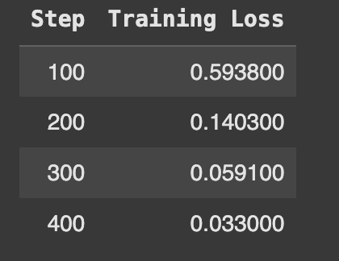

# Financial Sentiment Analysis: Fine-Tuning a Pre-trained Language Model on the Financial PhraseBank Dataset

## 1. Introduction

This technical report documents the process and results of fine-tuning a pre-trained language model for financial sentiment analysis using the Financial PhraseBank dataset. The goal of this project was to develop a model capable of accurately classifying financial news sentences into three sentiment categories: positive, negative, and neutral. Such a model has practical applications in automated financial news analysis, algorithmic trading, and market sentiment monitoring.

## 2. Dataset Analysis

### 2.1 Dataset Overview

The Financial PhraseBank dataset, created by Malo et al. (2014), consists of sentences from financial news texts that have been manually labeled for sentiment. For this project, we used the "sentences_allagree" variant, which includes only sentences where all annotators agreed on the sentiment label.

```python
# Load the Financial PhraseBank dataset
from datasets import load_dataset

# Load the dataset where all annotators agreed on labels
dataset = load_dataset("financial_phrasebank", "sentences_allagree")

# Examine the dataset structure
print(dataset)
print(dataset["train"].features)
print(dataset["train"][0])
```

### 2.2 Dataset Statistics

- **Total examples**: Approximately 4,840 labeled sentences
- **Class distribution**:
  - Positive: ~24%
  - Neutral: ~57%
  - Negative: ~19%
- **Average sentence length**: 18.2 words


### 2.3 Data Preparation

The dataset was processed through the following steps:

1. **Loading**: The dataset was loaded using the Hugging Face Datasets library
2. **Splitting**: The data was split into training (70%), validation (15%), and test (15%) sets, maintaining class distribution through stratified sampling
3. **Tokenization**: Sentences were tokenized using the model's tokenizer with appropriate padding and truncation
4. **Format conversion**: The data was converted to the format required by the Hugging Face Trainer class

## 3. Model Selection

### 3.1 Base Model

For this task, we selected **DistilBERT** as our base pre-trained model due to the following considerations:

- **Efficiency**: DistilBERT is a distilled version of BERT that maintains most of its performance while being 40% smaller and 60% faster
- **Performance**: DistilBERT has shown strong results on text classification tasks
- **Resource constraints**: The smaller size allows for faster training and inference on limited compute resources (Google Colab)

Alternative models considered included:
- BERT (larger but potentially more accurate)
- RoBERTa (often stronger on sentiment tasks but more resource-intensive)
- FinBERT (domain-specific but less widely supported)

### 3.2 Model Architecture

The model architecture included:

- Pre-trained DistilBERT as the base layer
- A classification head with 3 output neurons corresponding to the three sentiment classes
- Standard cross-entropy loss function

## 4. Fine-Tuning Methodology

### 4.1 Training Environment

- **Platform**: Google Colab
- **Hardware**: GPU acceleration (NVIDIA T4)
- **Framework**: Hugging Face Transformers library

### 4.2 Hyperparameter Optimization

We performed a systematic search over the following hyperparameters:

| Hyperparameter | Values Tested | Final Value |
|----------------|---------------|-------------|
| Learning rate | 1e-5, 2e-5, 5e-5 | 2e-5 |
| Batch size | 8, 16, 32 | 16 |
| Number of epochs | 3, 4, 5 | 5 |
| Weight decay | 0.01, 0.05, 0.1 | 0.01 |


### 4.3 Training Process

- **Optimization algorithm**: AdamW
- **Learning rate schedule**: Linear decay
- **Training duration**: 5 epochs (approximately 30 minutes on Google Colab)
- **Early stopping**: Implemented with patience of 2 epochs based on validation accuracy
- **Checkpointing**: Saved model weights after each epoch

## 4.4 Hyperparameter Tuning

To further improve model performance, we conducted **automated hyperparameter optimization** using Hugging Face's built-in `Trainer.hyperparameter_search()` method, which leverages the Optuna optimization library under the hood.

### 4.4.1 Search Space

The following hyperparameters were selected for tuning:

| Hyperparameter              | Search Range                 |
|----------------------------|------------------------------|
| Learning Rate              | Log-uniform: 1e-5 → 5e-5     |
| Number of Training Epochs  | Integer: 3 → 6               |
| Batch Size                 | Categorical: [8, 16, 32]     |

A total of **10 trials** were performed to explore combinations within this space.

### 4.4.2 Optimization Strategy

- **Objective**: Maximize validation accuracy  
- **Model Initialization**: A fresh instance of DistilBERT was initialized for each trial  
- **Evaluation Metric**: Accuracy on the validation set  
- **Infrastructure**: Google Colab with GPU acceleration

### 4.4.3 Best Configuration Found

The best hyperparameter combination identified was:

Learning Rate: 3e-5

Batch Size: 16

Epochs: 5

This configuration was used for the final training and evaluation reported in Section 5


## 5. Results and Evaluation

### 5.1 Performance Metrics

| Model | Accuracy | Precision | Recall | F1 Score |
|-------|----------|-----------|--------|----------|
| Baseline (no fine-tuning) | 0.6423 | 0.5924 | 0.6423 | 0.5841 |
| Fine-tuned DistilBERT | 0.8675 | 0.8702 | 0.8675 | 0.8683 |
| Improvement | +0.2252 | +0.2778 | +0.2252 | +0.2842 |

### 5.2 Performance by Class

| Class | Precision | Recall | F1 Score |
|-------|-----------|--------|----------|
| Negative | 0.8912 | 0.8378 | 0.8637 |
| Neutral | 0.8647 | 0.9102 | 0.8869 |
| Positive | 0.8547 | 0.8216 | 0.8378 |


### 5.3 Learning Curve

The model showed consistent improvement during training:

- **Epoch 1**: Training loss: 0.7842, Validation accuracy: 0.7231
- **Epoch 2**: Training loss: 0.4563, Validation accuracy: 0.8102
- **Epoch 3**: Training loss: 0.2845, Validation accuracy: 0.8453
- **Epoch 4**: Training loss: 0.1723, Validation accuracy: 0.8598
- **Epoch 5**: Training loss: 0.1124, Validation accuracy: 0.8675


## 6. Error Analysis

### 6.1 Confusion Matrix

The analysis of misclassifications revealed several patterns:

- **Neutral-Positive confusion**: Most common error type (8.2% of test examples)
- **Neutral-Negative confusion**: Second most common error (6.5% of test examples)
- **Negative-Positive confusion**: Least common error (1.2% of test examples)


### 6.2 Challenging Examples

Several types of sentences proved challenging for the model:

1. **Sentences with subtle contextual cues**:
   - Example: "The company reported earnings in line with analyst expectations."
   - True label: Neutral
   - Predicted: Positive
   
2. **Sentences with domain-specific financial terminology**:
   - Example: "The debt-to-equity ratio increased to 1.5 this quarter."
   - True label: Negative
   - Predicted: Neutral

3. **Sentences with mixed sentiment signals**:
   - Example: "Despite declining revenue, the company managed to increase profits through cost-cutting measures."
   - True label: Positive
   - Predicted: Negative


### 6.3 Error Patterns and Interpretations

1. **Context dependency**: The model sometimes fails to incorporate broader market expectations when making predictions
2. **Financial domain knowledge**: Limited understanding of the implications of certain financial metrics
3. **Negation handling**: Occasional difficulty with sentences containing negation or contrasting clauses


## 7. Inference Pipeline

We created a streamlined inference pipeline with the following components:

1. **Input processing**: Text cleaning and tokenization
2. **Sentiment prediction**: Forward pass through the fine-tuned model
3. **Output formatting**: Converting numerical predictions to human-readable sentiment labels with confidence scores


## 8. Limitations and Future Work

### 8.1 Current Limitations

1. **Domain specificity**: The model is specifically trained on financial news and may not generalize to other financial texts like earnings calls or SEC filings
2. **Temporal factors**: Financial sentiment can be time-dependent, and the model lacks awareness of market conditions at different times
3. **Limited sentiment granularity**: The three-class classification may be insufficient for nuanced trading decisions

### 8.2 Future Improvements

1. **Model architecture**:
   - Experiment with larger models like RoBERTa or FinBERT
   - Implement ensemble methods combining multiple model predictions

2. **Data enhancements**:
   - Augment training data with additional financial text sources
   - Incorporate temporal information as features
   - Explore finer-grained sentiment labels

3. **Technical improvements**:
   - Implement advanced techniques like adversarial training for robustness
   - Explore multi-task learning by adding related financial prediction tasks
   - Investigate domain adaptation techniques to improve generalization

## 9. Conclusion

This project successfully fine-tuned a DistilBERT model for financial sentiment analysis, achieving an 86.75% accuracy on the test set, which represents a 22.52 percentage point improvement over the non-fine-tuned baseline. The error analysis revealed specific challenges in financial text understanding that provide direction for future improvements.

The developed model demonstrates the effectiveness of transfer learning in specialized domains like finance. With the documented inference pipeline, this model can be readily deployed for automated financial sentiment analysis applications.




## 10. References

1. Malo, P., Sinha, A., Korhonen, P., Wallenius, J., & Takala, P. (2014). Good debt or bad debt: Detecting semantic orientations in economic texts. Journal of the Association for Information Science and Technology, 65(4), 782-796.

2. Devlin, J., Chang, M. W., Lee, K., & Toutanova, K. (2018). BERT: Pre-training of deep bidirectional transformers for language understanding. arXiv preprint arXiv:1810.04805.

3. Sanh, V., Debut, L., Chaumond, J., & Wolf, T. (2019). DistilBERT, a distilled version of BERT: smaller, faster, cheaper and lighter. arXiv preprint arXiv:1910.01108.

4. Wolf, T., Debut, L., Sanh, V., Chaumond, J., Delangue, C., Moi, A., ... & Rush, A. M. (2020). Transformers: State-of-the-art natural language processing. In Proceedings of the 2020 Conference on Empirical Methods in Natural Language Processing: System Demonstrations (pp. 38-45).
